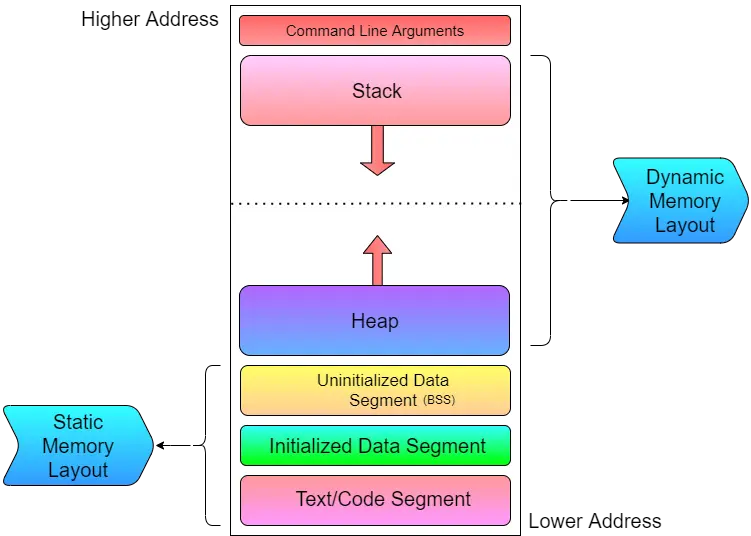

Basic Memory Allocation
========================
Table of content : 

1. **[Basic Memory Allocation](#basic-memory-allocation)**
2. **[malloc](#malloc)**
3. **[calloc](#calloc)**
4. **[realloc](#realloc)**
5. **[free](#free)**

<hr />

## Basic Memory Allocation

If user can allocate own memory in c. This type of memory called heap. C create space in heap.The Typical Memory Layout of a C Program consists of the following segments:

1. Command Line Argument
1. Stack
1. Heap
1. Uninitialized Data Segment (BSS)
1. Initialized Data Segement
1. Text/Code Segment

**_See Memory Systen in picture :_**

;

4 type of function commonly use in that case.

| function_name | function_work      |
| ------------- | ------------------ |
| malloc        | allocate memory    |
| calloc        | allocate memory(c) |
| realloc       | reallocate memory  |
| free          | free the memory    |

All this function inside the <stdlib.h> header directory.

## malloc

allocate the memory with size in bite.

**_malloc prototype :_**

```c
void * malloc(int size);
```

**_Example of malloc:_**

```c
#include <stdio.h>
#include <string.h>
#include <stdlib.h>

// malloc
// prototype : void * malloc(byte_size)
// header file <stdlib.h>

// custom data type
typedef struct
{
    char name[30];
    int age : 15
} Person;

int main(void){
    // alocate int type date
    int *number_one_ptr = (int *) malloc(sizeof(int));

    *number_one_ptr = 100;

    printf(">>>> number_one_ptr = %x\n",number_one_ptr);
    printf(">>>> *number_one_ptr = %d\n",*number_one_ptr);

    // alocate struct type data
    Person *person_list = (Person *) malloc(sizeof(Person)*2);

    // set person one int list
    strcpy(person_list->name,"Md Tazri");
    person_list->age = 30;

    strcpy((person_list+1)->name,"Focasa");
    (person_list+1)->age = 22;

    for(int i = 0; i < 2; i++){
        printf("\n>>>> Person %d Details <<<<\n",i+1);
        printf(">>>> Name : %s\n",(person_list+i)->name);
        printf(">>>> Age : %d\n",(person_list+i)->age);
        printf(">>>> Finish <<<<\n");
    }

    // print finish program
    printf("\n--\n-\n>>>> Finish Program <<<<\n");
    return 0;
}
```

**_Result :_**

```
>>>> number_one_ptr = 6d2632a0
>>>> *number_one_ptr = 100

>>>> Person 1 Details <<<<
>>>> Name : Md Tazri
>>>> Age : 30
>>>> Finish <<<<

>>>> Person 2 Details <<<<
>>>> Name : Focasa
>>>> Age : 22
>>>> Finish <<<<

--
-
>>>> Finish Program <<<<
```

## calloc

calloc work like malloc but it initialy set variable value as 0 and it has two parameter

```c
void *calloc(int n_times,int size);
```

**_Example of calloc :_**

```c
#include <stdio.h>
#include <stdlib.h>
#include <string.h>

// calloc
// prototype : void * calloc(size_t nitems,size_t size);

int main(void){
    int *number_list = NULL;
    number_list = (int *)calloc(4,sizeof(int));

    *number_list = 30;
    *(number_list + 1) = 40;
    *(number_list + 2) = 50;
    *(number_list + 3) = 60;

    for(int i = 0; i < 4; i++){
        printf(">>>> Number %d = %d\n",i+1,*(number_list+i));
    }

    // printf finsih
    printf("\n--\n-\n>>>> Finish Program <<<<\n");
    return 0;
}
```

**_Result :_**

```
>>>> Number 1 = 30
>>>> Number 2 = 40
>>>> Number 3 = 50
>>>> Number 4 = 60

--
-
>>>> Finish Program <<<<
```

## realloc

realloc reallocate the memory.

realloc prototype :

```c
void * realloc(size_t size,void * ptr);
```

**_Example of realloc :_**

```c
#include <stdio.h>
#include <stdlib.h>

// realloc

int main(void){
    // allocate the memory
    int *numbers_ptr = NULL;
    numbers_ptr = (int *) malloc(3*sizeof(int));

    // store the data
    *(numbers_ptr + 0) = 10;
    *(numbers_ptr + 1) = 20;
    *(numbers_ptr + 2) = 30;

    // print all data
    printf("\n>>>> Before reallocate <<<<\n");
    for(int i = 0; i < 5; i++){
        printf(">>>> Number[%d] = %d\n",i+1,*(numbers_ptr + i));
    }
    printf(">>>> Finish <<<<\n");

    // realocate the memory
    numbers_ptr = realloc(numbers_ptr,5*sizeof(int));

    *(numbers_ptr + 3) = 40;
    *(numbers_ptr + 4) = 50;

    // print all data
    printf("\n>>>> After reallocate <<<<\n");
    for(int i = 0; i < 5; i++){
        printf(">>>> Number[%d] = %d\n",i+1,*(numbers_ptr + i));
    }
    printf(">>>> Finish <<<<\n");

    // free the memory
    free(numbers_ptr);

    // printf finish
    printf("\n--\n-\n>>>> Finish Program <<<<\n");
    return 0;
}
```

**_Result :_**

```c
>>>> Before reallocate <<<<
>>>> Number[1] = 10
>>>> Number[2] = 20
>>>> Number[3] = 30
>>>> Number[4] = 0
>>>> Number[5] = 0
>>>> Finish <<<<

>>>> After reallocate <<<<
>>>> Number[1] = 10
>>>> Number[2] = 20
>>>> Number[3] = 30
>>>> Number[4] = 40
>>>> Number[5] = 50
>>>> Finish <<<<

--
-
>>>> Finish Program <<<<
```

## free

free funtion free the memory. When allocate the memory in heap. must be free this memory otherwise waste of memory space.

**_free prototype :_**

```c
void free(void *ptr_block);
```

**_Example :_**

```c
#include <stdio.h>
#include <stdlib.h>

int main(void){
    // create number pointer for alocate memory
    int *number_pointer = NULL;
    number_pointer = (int *) calloc(1,sizeof(int));

    *number_pointer = 200;
    printf("\n>>>> Before Erase Memory <<<<\n");
    printf(">>>> number_pointer : %x\n",number_pointer);
    printf(">>>> *number_pointer : %d\n",*number_pointer); // 200

    // Erase Memory
    free(number_pointer);

    printf("\n>>>> After Erase Memory <<<<\n");
    printf(">>>> number_pointer : %x\n",number_pointer);
    printf(">>>> *number_pointer : %d\n",*number_pointer); // 0

    // printf finish
    printf("\n--\n-\n>>>> Finish Program <<<<\n");
    return 0;
}
```

**_Result :_**

```
>>>> Before Erase Memory <<<<
>>>> number_pointer : fa0f02a0
>>>> *number_pointer : 200

>>>> After Erase Memory <<<<
>>>> number_pointer : fa0f02a0
>>>> *number_pointer : 0

--
-
>>>> Finish Program <<<<
```

<hr />

[< Preprocessor Directive](./11.preprocessor_directive.md) | [README >](../README.md)
-------------------------------------------------